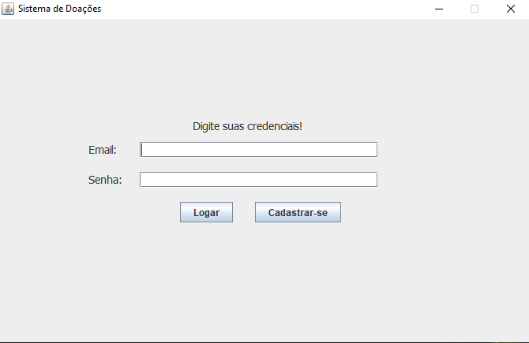
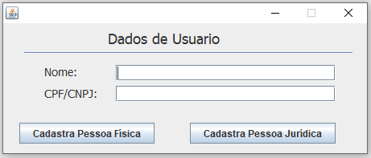
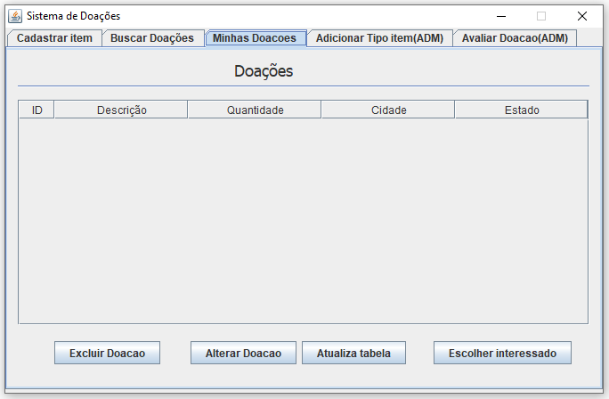
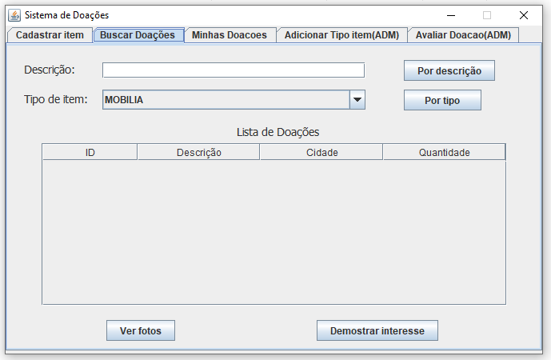
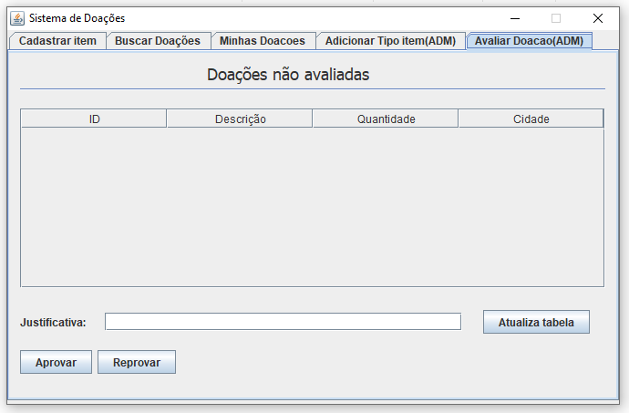
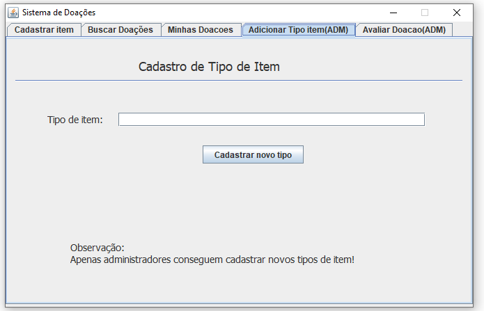

# Sistema-de-doacoes-JAVA
O projeto utiliza a linguagem JAVA, para a construção de um sistema de doações. O armazenamento, é feito utilizando a biblioteca Gson, onde todos os dados do aplicativo, são salvos em arquivos locais no formato json.

Neste sistema podem ser cadastrados dois tipos de usuários, um usuário que pode receber e doar, e um usuário que é cadastrado como administrador, o administrador consegue adicionar um novo tipo de doação, e verificar se determinado item pode ser doado. Antes de um item aparecer para doação, o administrador precisa avaliá-lo e dizer se o item é valido para doação ou não.

## Telas
### Tela de login

### Tela de cadastro de usuario
Quando o usuário clica em cadastrar-se na tela de login, essa nova tela aparece requerindo o nome do usuário e seu número de documento, podendo um usuário ser pessoa física ou pessoa juridica.

### Tela de minhas doações
Nesta tela o usuário pode ver suas doações, para alterar dados da doação, excluí-la ou escolher uma pessoa que tenha marcado interesse nessa doação.

### Tela de buscar doações
Nesta tela, um usuário pode verificar, todos os itens que estão sendo doados.

### Tela de avaliar doações
Nessa tela o administrador pode avaliar as doações que os usuários adicionaram para doar, ele verifica se a doação pode ser doada e coloca em doação.

### Tela de adicionar tipo item
Tela onde um administrador por adicionar um novo tipo de item que os outros usuários poderão adicionar.

## Tecnologias
 - Java
 - Json

## Autor
 - Pablo Henrique Santos